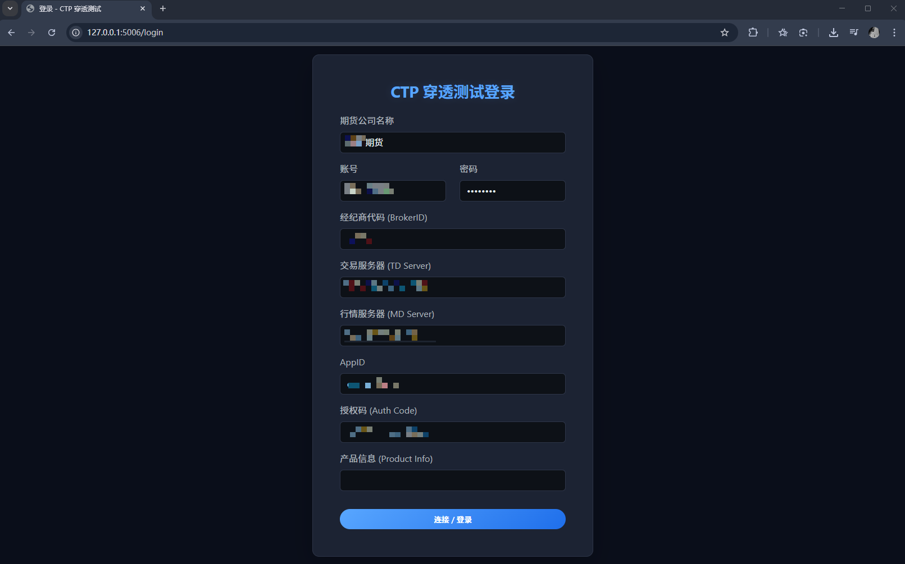
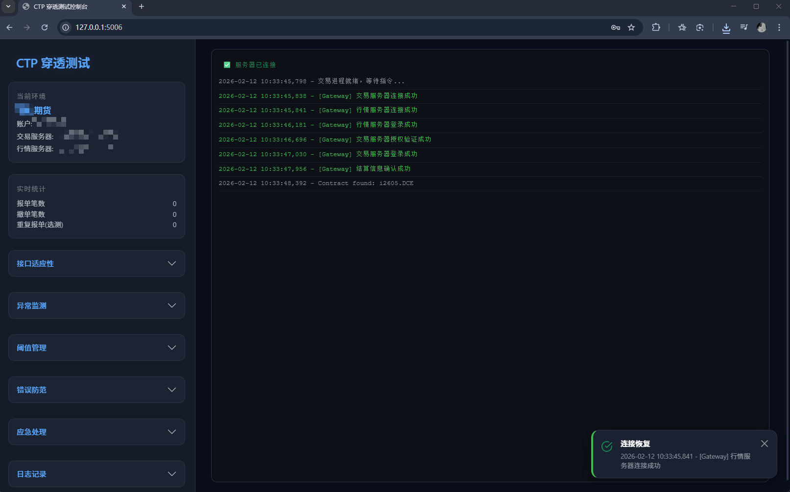
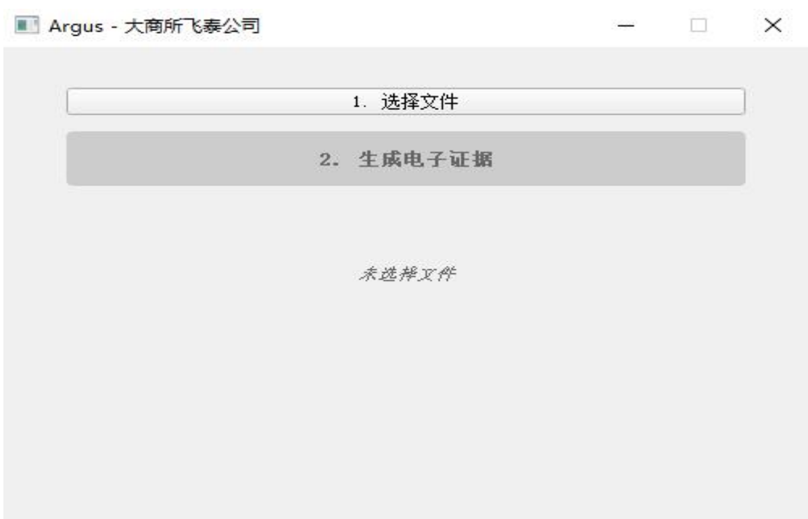
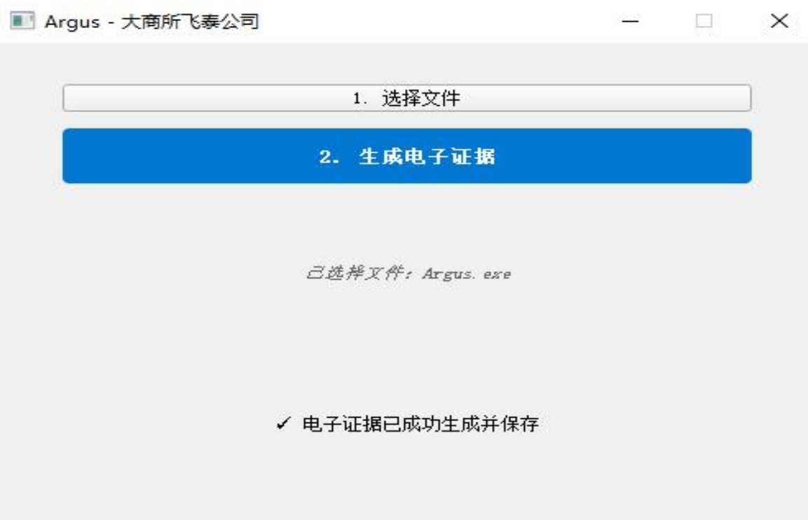
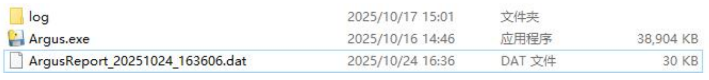

# ctp-penetration-test-kit —— 速通CTP穿透测试

## 项目综述

本项目专为期货公司 **CTP 穿透测试** 需求设计，旨在帮助开发者和交易员快速通过CTP穿透测试。工具基于 `vnpy` 框架开发，提供了一套自动化的测试用例集，覆盖了穿透测试报告中要求的关键测试点，包括连通性测试、基础交易功能、异常监测、风控阈值管理及应急处理功能。

通过本项目，您可以：
- 快速执行标准化的穿透测试流程。
- 自动生成部分测试记录日志。
- 通过 Web 界面直观监控测试进度与资金状态。
- 灵活配置测试合约与风控参数。

### 界面预览

<p align="center">
  
  <br><em>登录界面</em>
</p>

<p align="center">
  
  <br><em>Web 控制台</em>
</p>

### 项目结构

```text
├── .env.example              # 环境变量模板
├── .gitignore
├── config.yaml               # 测试合约与风控阈值配置
├── LICENSE
├── README.md
├── requirements.txt
├── run.bat                   # 一键启动脚本
│
├── doc/                      # 文档
│
├── lib/                      # 修改版第三方库（vnpy / vnpy_ctp / vnpy_ctptest）
│
└── src/
    ├── __init__.py
    ├── path_setup.py          # sys.path 注入唯一来源
    │
    ├── config/                # 配置加载
    │   ├── __init__.py
    │   └── reader.py          # .env / config.yaml 读写、全局常量
    │
    ├── logging/               # 日志系统
    │   ├── __init__.py
    │   ├── setup.py           # 日志初始化、log_info / log_warning / log_error
    │   ├── color.py           # 统一日志颜色分配函数
    │   └── handlers.py        # SocketIOHandler / QueueLogHandler
    │
    ├── core/                  # 交易核心
    │   ├── __init__.py
    │   ├── engine.py          # TestEngine（CTP 连接、报单、撤单、事件处理）
    │   ├── risk.py            # 风控管理器
    │   └── server.py          # RPC 命令服务器
    │
    ├── worker/                # Worker 子进程
    │   ├── __init__.py
    │   └── controller.py      # WorkerController + main()
    │
    ├── ctp_cases/             # CTP 穿透测试用例
    │   ├── __init__.py
    │   ├── cases.py           # 30+ 测试用例函数
    │   └── helpers.py         # wait_for_reaction / clean_environment
    │
    └── web/                   # Web 控制台
        ├── __init__.py
        ├── app.py             # Flask 路由 + SocketIO 事件
        ├── process_manager.py # Worker 进程管理
        ├── rpc_client.py      # JSON-over-TCP RPC 客户端
        ├── static/css/style.css
        └── templates/
            ├── index.html
            └── login.html
```

## 2. 快速开始

### 2.1. 环境准备

确保您已安装 Python 3.10+ 环境。

```bash
# 克隆项目
git clone https://github.com/maroonxv/ctp-penetration-test-kit.git
cd ctp-penetration-test-kit

# 安装依赖
pip install -r requirements.txt
```

### 2.2. 配置参数

1.  复制环境配置文件模板：
    ```bash
    cp .env.example .env
    ```
2.  编辑 `.env` 文件，填入您的 CTP 测试账户信息（账号、密码、BrokerID、前置机地址等）。
3.  编辑 `config.yaml` 文件，配置测试合约代码、价格及风控阈值。

### 2.3. 运行测试

启动 Web 控制台：

```bash
python src/web/app.py
```

浏览器访问 `http://localhost:5006`，点击相应的测试按钮即可开始执行测试用例。

---

## 3. 测试过程记录详情

### 3.1. 接口适应性

#### 3.1.1. 连通性

| 项目 | 内容 |
| :--- | :--- |
| **测试目标** | 检查期货程序化交易系统与交易信息系统的连通性是否正常 |
| **通过要求** | 期货程序化交易系统能够通过宏源期货交易信息系统（柜台）认证，并完成账号登录 |
| **测试过程** | 测试点2.1.1：验证登录测试账号通过宏源期货交易信息系统（柜台）认证、完成账号登录 |
| **判定** | |
| **改善建议** | N/A |

#### 3.1.2. 基础交易功能

| 项目 | 内容 |
| :--- | :--- |
| **测试目标** | 检查期货程序化交易系统是否具备基础交易功能 |
| **通过要求** | 期货程序化交易系统具备基础交易功能 |
| **测试过程** | 2.1.2.1：验证能正常下达开仓指令<br>2.1.2.2：验证能正常下达平仓指令<br>2.1.2.3：验证能正常下达撤单指令（测试撤单指令） |
| **判定** | |
| **改善建议** | N/A |

### 3.2. 异常监测

#### 3.2.1. 系统连接异常监测功能

| 项目 | 内容 |
| :--- | :--- |
| **测试目标** | 检查期货程序化交易系统是否具备系统连接状态监测功能 |
| **通过要求** | 期货程序化交易系统具备监测系统连接状态的功能 |
| **测试过程** | 2.2.1.1：验证与宏源期货交易信息系统（柜台）连接成功时，能正常显示连接成功<br>2.2.1.2：验证与宏源期货交易信息系统（柜台）连接断开，能正常显示连接断开<br>2.2.1.3：验证与宏源期货交易信息系统（柜台）连接断开，能正常显示重连成功 |
| **判定** | |
| **改善建议** | N/A |

#### 3.2.2. 报撤单笔数监测功能

| 项目 | 内容 |
| :--- | :--- |
| **测试目标** | 检查期货程序化交易系统是否具备报撤单笔数监测功能 |
| **通过要求** | 期货程序化交易系统具备报撤单笔数统计及监测的功能 |
| **测试过程** | 2.2.2.1：验证能正常统计报单笔数<br>2.2.2.2：验证能正常统计撤单数 |
| **判定** | |
| **改善建议** | N/A |

#### 3.2.3. 重复报单监测功能(选测项目)

| 项目 | 内容 |
| :--- | :--- |
| **测试目标** | 检查期货程序化交易系统是否具备重复报单监测功能 |
| **通过要求** | 期货程序化交易系统具备监测重复报单的功能 |
| **测试过程** | 2.2.3.1：验证能正常统计重复下达买卖方向、委托数量、委托价格均相同的交易指令开仓单的报单笔数<br>2.2.3.2：验证能正常统计重复下达买卖方向、委托数量、委托价格均相同的交易指令平仓单的报单笔数<br>2.2.3.3：验证能正常统计重复下达买卖方向、委托数量、委托价格均相同的交易指令撤单的报单笔数 |
| **判定** | |
| **改善建议** | N/A |

### 3.3. 阈值管理

#### 3.3.1. 阈值设置及预警功能

| 项目 | 内容 |
| :--- | :--- |
| **测试目标** | 检查期货程序化交易系统是否能够根据风险控制需要设置指标阈值，并在指标达到或超过设置阈值后进行预警。指标至少能够满足异常监测需要。 |
| **通过要求** | 期货程序化交易系统具备指标阈值设置的功能，并在指标达到或超过设置阈值后进行预警。 |
| **测试过程** | 2.3.1.1：验证提供报单笔数统计阈值设置功能<br> 2.3.1.2：验证报单笔数统计值达到或超过阈值时会给予警示<br>2.3.1.3：验证报撤单笔数统计与阈值设置功能<br>2.3.1.4：验证报撤单笔数统计值达到或超过阈值时会给予警示<br>2.3.1.5（选测）：验证重复报单笔数统计与阈值设置功能<br>2.3.1.6（选测）：验证重复报单笔数统计值达到或超过阈值时会给予警示 |
| **判定** | |
| **改善建议** | N/A |

### 3.4. 错误防范

#### 3.4.1. 交易指令检查功能

| 项目 | 内容 |
| :--- | :--- |
| **测试目标** | 检查期货程序化交易系统是否具备交易指令检查功能，防范下达错误交易指令 |
| **通过要求** | 期货程序化交易系统具备交易指令检查及拒绝错误交易指令下达的功能，包括合约代码、合约最小变动价位、单笔委托最大手数等错误 |
| **测试过程** | 2.4.1.1：验证订单合约代码错误时，系统能检查出错误并拒绝报单<br>2.4.1.2：验证订单价格最小变动价位错误时，系统能检查出错误并拒绝报单<br>2.4.1.3：验证订单委托数量超单笔最大委托数量时，系统能检查出错误并拒绝报单 |
| **判定** | |
| **改善建议** | N/A |

#### 3.4.2. 错误提示功能

| 项目 | 内容 |
| :--- | :--- |
| **测试目标** | 检查期货程序化交易系统是否具备接收交易所、交易信息系统返回错误提示的功能 |
| **通过要求** | 期货程序化交易系统具备接收并展示错误提示信息的功能，包括无足够资金开仓、无仓位可平、市场状态不允许等 |
| **测试过程** | 2.4.2.1：验证系统能正常接收并展示柜台返回的资金不足错误码<br>2.4.2.2：验证系统能正常接收并展示柜台返回的持仓不足错误码<br>2.4.2.3：验证系统能正常接收并展示柜台返回的市场状态错误码（需测试） |
| **判定** | |
| **改善建议** | N/A |

### 3.5. 应急处理

#### 3.5.1. 暂停交易功能

| 项目 | 内容 |
| :--- | :--- |
| **测试目标** | 检查期货程序化交易系统是否具备暂停下达交易指令功能 |
| **通过要求** | 期货程序化交易系统具备限制账号交易权限、暂停策略执行、强制账号退出等一种或多种暂停交易指令下达的功能 |
| **测试过程** | 2.5.1.1：验证系统可通过限制账号交易权限方式暂停交易<br>2.5.1.2：验证系统可通过暂停策略执行方式暂停交易（需显示测试时间，截全屏显示电脑时间）<br>2.5.1.3：验证系统可通过强制账号退出执行方式暂停交易（需显示测试时间，截全屏显示电脑时间） |
| **判定** | |
| **改善建议** | N/A |

#### 3.5.2. 批量撤单功能（选测项目）

| 项目 | 内容 |
| :--- | :--- |
| **测试目标** | 检查期货程序化交易系统是否具备批量撤单功能 |
| **通过要求** | 期货程序化交易系统具备部撤、全部撤单的批量撤单功能 |
| **测试过程** | 2.5.2.1：验证系统支持将多笔部分成交的报单进行批量撤单<br>2.5.2.2：验证系统支持将多笔已报单进行批量撤单 |
| **判定** | |
| **改善建议** | N/A |

### 3.6. 日志记录

#### 3.6.1. 日志记录功能

| 项目 | 内容 |
| :--- | :--- |
| **测试目标** | 检查期货程序化交易系统是否具备日志记录功能 |
| **通过要求** | 期货程序化交易系统具备日志记录功能，且能够满足业务追溯需要。记录内容包括但不限于交易日志、系统运行记录、监测记录、错误提示记录 |
| **测试过程** | 2.6.1.1：验证系统日志中会记录交易信息<br>2.6.1.2：验证系统日志中会记录系统运行信息<br>2.6.1.3：验证系统日志中会记录监测信息（补全）<br>2.6.1.4：验证系统日志中会记录错误提示信息（补全） |
| **判定** | |
| **改善建议** | N/A |


## 4. 程序化证据收集工具使用指引


为保证测试报告的有效性及与被测程序的关联性，测试完成后需收集程序化系统的相关信息作为电子化证据。根据程序部署形式的不同，分为以下两种情况。

### 4.1 终端存在 Windows 客户端

使用程序化证据收集工具进行电子化证据收集。

1. **解压与启动**：将收到的压缩包解压至测试环境任意位置，运行文件夹内的 `Argus.exe`。

   

2. **生成电子证据**：点击「1. 选择文件」，选择正在测试的程序化交易系统启动文件（`.exe` / `.dll` 等），然后点击「2. 生成电子证据」。

   

3. **获取证据文件**：提示"电子证据已成功生成并保存"后，在 `Argus.exe` 同级目录下会生成加密文件，命名格式为 `ArgusReport_操作日期_操作时间.dat`。

   

### 4.2 终端仅有 Linux 服务

无需使用 `Argus.exe`，直接通过命令行对程序启动文件生成 SHA256 摘要：

```bash
sha256sum 程序启动文件 > ArgusReport_yyyymmdd_HHMMSS.dat
```

> 时间戳按实际执行时间替换即可。


